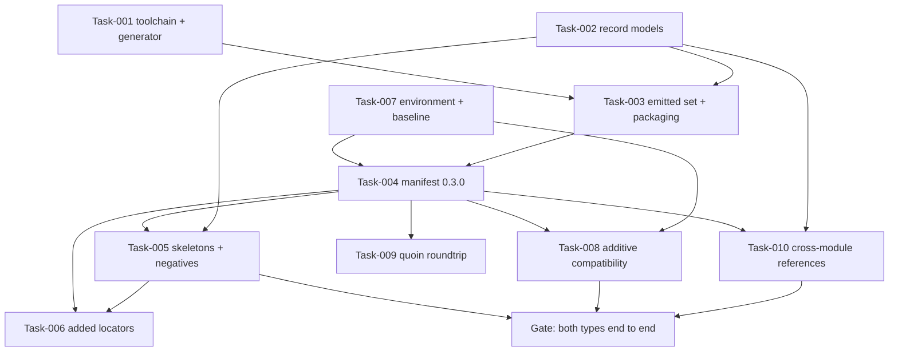

# Implementation Plan: semantic module contract

## Requirements Summary

### Stakeholder Requirements
- [x] **StR-001**: Safety analysis is recorded as validated, linkable objects (VC-1, VC-2).

### User Stories
- [x] **US-001**: Declare the safety object types against the shared semantic core, so a reader — person, generator or neighbouring module — sees the contract that was authored.

### Functional Requirements
- [x] **FR-001**: `hazard` and `failure_mode` are separate object types with distinct body contracts (unchanged at 0.3.0; AC-1's "at least one role" half is agent-ix/spec-objects-safety#3).
- [x] **FR-002**: Emit one JSON Schema 2020-12 document per model from `typespec/main.tsp` with the official emitter at a pinned toolchain; normalize, gate drift, package, and embed the version in the `$id`.
- [x] **FR-003**: The manifest carries the quoin FR-070 `semantic` block and reference-form `data_schema` at version 0.3.0, with every 0.2.0 locator and every traceability fact unchanged.
- [x] **FR-004**: Type-distinct sealed record schemas whose scored axes keep `unknown`, `not_assessed` and `not_applicable` distinct from every scale value, with no default anywhere and no acceptance without provenance.
- [x] **FR-005**: The skeletons are executable typed fixtures with `sysml` alternates and seven negative counterparts; the semantic tests fail rather than skip without the engine.
- [x] **FR-006**: Controls, risks, architecture, operational and evidence types are referenced by `SemanticId` and never redeclared; `imports` is empty for a stated reason.

### Non-Functional Requirements
- [x] **NFR-001**: Additive compatibility — zero 0.2.0 locators changed, every added locator optional, every 0.2.0 document still valid, the traceability model unchanged, the advisory lists widened and never narrowed.

### Integration Tests
- [ ] **IT-001**: Quoin install roundtrip. Backed by a tagged test; carried `🚧` because the installed CLI cannot read its own packaged schemas.

## Dependency Graph

The one ordering that is not obvious: **Task-005 lands the skeleton sections before
Task-006 adds their locators.** Declaring a locator for a heading no skeleton yet has
would make the module assert a section that does not exist, and the reverse order is
what breaks the FR-003↔FR-005 cycle the requirements read as circular.

## Execution Tracks

| Track | Tasks | Character |
|---|---|---|
| A | 001, 002, 003, 004, 005, 007, 011 | The critical path: nothing downstream is worth building until the gate passes. |
| B | 006, 008, 010 | Parallel once the manifest is at 0.3.0; each verifies a boundary rather than building one. |
| C | 009 | Post-critical-path, and the only task whose evidence needs infrastructure this repository cannot provision. |

## Quality Gates

**Gate (Task-011): both object types end to end, and the epistemic property.**
Skeleton → extraction → record → emitted schema green for both types in both Properties
forms; every scored axis admitting its scale and the three epistemic states and nothing
else; acceptance refused without provenance; `quire validate` structurally clean;
`quire coverage` reporting every matrix row backed. A failure here means the emitter
recipe or the epistemic modelling is wrong, and every task after it would be wasted.

## Test Plan

Every acceptance criterion, named constraint and NFR metric in `spec/tests.md` maps to a
test case, and every test case to a `@pytest.mark.trace`-tagged symbol. The matrix is
authoritative; this section names only what the plan adds to it:

- **Schema evidence versus extraction evidence.** The module-specific record keys
  (`assessment`, `context`, `analysis`, `status`, `provenance`, `evidence`) have no
  published Markdown mapping (`agent-ix/quoin#335`), so their rows are verified against
  hand-built records. The tests say so; they are not extraction evidence and are not
  reported as such.
- **Two strict expected failures**, each naming the engine defect that owns it: a
  manifest refusal that names nothing (quire-rs#221, #394) and a legacy prose
  `## Properties` block that errors as well as warning (quire-rs#391). Strict, so the
  day the engine is fixed the suite says so.
- **One `🚧` row.** TC-070 is backed by a real tagged test that the ambient Quoin CLI
  cannot run today; it lives in `tests_integration/` rather than inflating a green
  `make test`.
