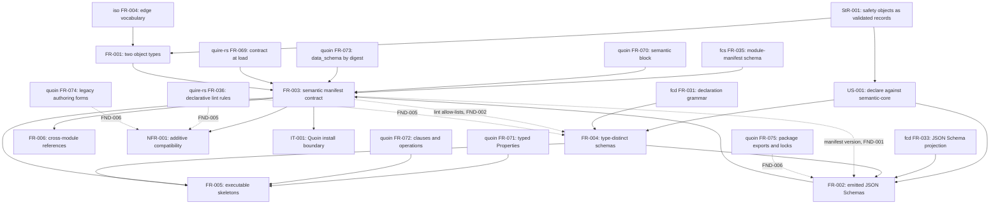

# Dependency and ordering analysis of the issue #2 semantic-module-contract specification

## Summary

Prerequisite analysis of the `2-semantic-module-contract` bundle for
`agent-ix/spec-objects-safety#2` (Track A wave 4 of `agent-ix/quoin#286`):
which requirements must be satisfied before which, which are enablement and
which are feature work, whether the graph is acyclic, and whether each upstream
blocker the Out of Scope section names is a real open dependency or an invented
gate.

The blocker audit comes back clean. All sixteen upstream issues the bundle names as blockers were
checked with `gh issue view`; every one exists and every one is **OPEN**, and
each is a published dependency or a filed engine defect rather than a policy
gate. The four sequencing prerequisites the epic declares for this ticket —
`agent-ix/filament-core-data#34`, `#35`, `agent-ix/quoin#293`,
`agent-ix/quire-rs#388` — are all **CLOSED**, so the enablement chain this
branch sits on is genuinely complete and nothing here is waiting on work that
could have been done first. One citation is stale
(`agent-ix/spec-objects-security#5`, closed) and one is mis-scoped
(`agent-ix/quoin#335`); one deferral (IT-001/TC-070) names no issue at all and
turns out to be a local install artifact rather than a dependency.

The ordering graph is not acyclic. Two cycles run through the manifest:
`FR-002 ↔ FR-003` (the emitted `$id` embeds the manifest `version`, while the
manifest digests are the generator's output) and
`FR-004 → FR-002 → FR-003 → FR-004` (FR-004 takes the manifest's three advisory
lint allow-lists as Inputs and asserts their contents in FR-004-AC-12). The
first is acknowledged operationally as "one atomic regeneration" but is declared
as an ordered pair; the second is declared nowhere and is invisible to a
topological sort. Both must be broken before `spec-to-plan` reads this bundle.

Seven mediums follow — two unowned or mis-owned deferrals, three undeclared
upstream edges (`quire-rs` FR-036, `quoin` FR-074 and FR-075), an unowned
obligation to re-assert two criteria when three engine defects land, and an
FR-035 attributed to the wrong repository — plus three lows.

## Verdict

**CONDITIONAL** — the two cycles must be broken before the bundle is tasked.
Findings are reported only; no spec artifact was edited by this review.

## Classification

| Requirement | Class | Rationale |
|---|---|---|
| StR-001 | Feature | The stakeholder need itself: safety analysis recorded as validated, linkable objects. Everything below exists to serve it. |
| FR-001 | Enablement | The 0.2.0 object-type declaration — manifest, body contracts, lexicon, `allowed_links`. No behaviour of its own; it is the substrate FR-003 extends and FR-006 constrains. Already satisfied at 0.2.0, so it is enablement that is *done*, not enablement to be built. |
| FR-002 | Enablement | Build-and-emission scaffolding: TypeSpec compile, `$id`/`$ref` normalization, digest regeneration, the `make schemas-check` gate. Nothing a spec author or reader ever sees. |
| FR-003 | Enablement | The manifest `semantic` block and reference-form `data_schema`. Pure contract declaration — it enables Quoin to verify and Quire to validate, and produces no domain behaviour. |
| FR-004 | Feature | The business-visible half of the module: the type-distinct schemas and the epistemic distinction that keeps `not_assessed` from reading as `negligible`. This is the property the module exists for and the one issue #2 lists as an acceptance criterion. |
| FR-005 | Feature | The authoring skeletons an engineer actually writes a hazard with, plus the negative counterparts that make the teaching example and the contract agree. User-visible artifacts. |
| FR-006 | Enablement | Boundary discipline, almost entirely negative obligations. Its only shipped artifact is `semantic.imports: {}` and the prose recording why. It constrains what may be declared rather than adding behaviour. |
| NFR-001 | Enablement | A compatibility guard over FR-003's manifest. It adds nothing a consumer can call; it bounds what FR-003 may change. |
| IT-001 | Verification | Not a requirement — the integration allocation verifying FR-003 across the Quoin install boundary. Listed for ordering completeness; it is last by construction. |
| US-001 | Narrative | Illustrative examples leading to FR-002..FR-006, per the `spec-artifacts-iso` US skeleton. Carries no prerequisite of its own. |

## Dependency Graph

Solid edges are declared in a requirement's frontmatter or its Dependencies
section. Dashed edges are real prerequisites the bundle does not declare — the
subject of FND-002, FND-005 and FND-006.

## Cycles

**Two, both through `manifest.yaml`.**

1. `FR-002 → FR-003 → FR-002`. FR-003 lists FR-002 upstream because the manifest
   carries the digests the generator computes. FR-002 lists the manifest
   `version` as an Input, requires `$id` to embed it (FR-002-AC-2, FR-002-CON-5),
   and FR-002-AC-8 makes the version, the schemas, the digests and
   `toolchain.json` one commit — while `version: 0.3.0` is FR-003's own output
   (FR-003-AC/Behavior). See FND-001.
2. `FR-004 → FR-002 → FR-003 → FR-004`. FR-004 Inputs take "the three advisory
   lint allow-lists the manifest declares" and FR-004-AC-12 asserts their
   membership; the manifest is FR-003's sole output; FR-003 depends on FR-002
   which depends on FR-004 for the models it emits. See FND-002.

The break the spec already reaches for — "one atomic regeneration ... in one
commit" — is the right resolution for cycle 1 but is stated as a bump procedure
inside FR-002 Behavior rather than as a declared ordering fact, so nothing
reading the Dependencies sections can see it. Cycle 2 has no stated break at
all.

## Topological Order (suggested implementation sequence)

Assuming both cycles are broken as FND-001 and FND-002 recommend — FR-002 and
FR-003 tasked as one indivisible unit, and the allow-list assertion moved off
FR-004.

1. **FR-001** — enablement, already satisfied at 0.2.0. No work; it is the
   baseline the rest is measured against. (`agent-ix/spec-objects-safety#3`
   carries its one open correction.)
2. **FR-004 (models only)** — the TypeSpec declarations, the vocabulary table,
   the epistemic distinctions. Nothing downstream can be emitted before the
   models exist.
3. **FR-002 + FR-003 as one unit** — emission, `$id` versioning, the manifest
   `semantic` block, digests, `version: 0.3.0`. These cannot be separately
   landable: half a bump is refused by `make schemas-check` by design.
4. **FR-004-AC-12 (allow-lists) and NFR-001-AC-5** — parallelizable, both read
   the manifest step 3 produced.
5. **FR-005, FR-006, NFR-001 (AC-1..AC-4)** — parallelizable features and
   guards over the completed contract.
6. **IT-001** — last; it exercises the installed copy of everything above.

Enablement precedes every feature that depends on it: FR-001 and the FR-002/
FR-003 unit before FR-005 and FR-006; FR-004's model declarations before the
emission that projects them.

## Blocker Audit

Every issue named in `spec.md` § Out of Scope and in the FR/NFR bodies, checked
with `gh issue view`. "Enablement" means the exclusion waits on work that must
exist before this module can do the thing; "boundary" means it is a scope
decision that needs no upstream at all.

| Named blocker | State | Real? | Kind | Note |
|---|---|---|---|---|
| `agent-ix/quire-rs#392` | OPEN | ✅ | Enablement | Release the 0.46.0 wheel to an index a repo may commit against. Verified: `quire-rs` has no tag past `v0.45.0`; 0.46.0 exists only on `pypi.ix`. See FND-010. |
| `agent-ix/quire-rs#221` | OPEN | ✅ | Engine defect | Unknown manifest key empties the model silently. Owns half of FR-003-AC-6. |
| `agent-ix/quire-rs#394` | OPEN | ✅ | Engine defect | `data_schema` digest mismatch empties the registry with no diagnostic. Owns the other half. |
| `agent-ix/quire-rs#391` | OPEN | ✅ | Engine defect | `validate_document` validates an unavailable kind as `{}`, so a legacy form errors under `legacy_forms: warning`. Owns NFR-001-AC-3. |
| `agent-ix/filament-core-service#23` | OPEN | ✅ | Enablement | Reference-form `data_schema` resolved into an activation snapshot. Correctly keeps activation out of IT-001. |
| `agent-ix/spec-artifacts-iso#36` | OPEN | ✅ | Enablement | Verified independently: `v0.18.0`'s `module-manifest.schema.json` has no `semantic` key; `6686f11` does. The CR-012 pin is genuine, not a convenience. |
| `agent-ix/quoin#335` | OPEN | ⚠ mis-scoped | Enablement | Real and open, but its body is scoped to `spec-objects-business`'s `## Values`/enumeration keys and names neither this module's `Assessment`/`Analysis` tables nor `status`/`provenance`/`evidence`. See FND-003. |
| `agent-ix/quoin#290` | OPEN | ✅ | Gate | `[GATE] Publish semantic module packages and promote enforcement only after human sign-off`. A declared programme gate with an owner, not one invented here. |
| `agent-ix/quoin#291` | OPEN | ✅ | Gate | `[GATE] Measure the full corpus ... (advisory, report only)`. Same. |
| `agent-ix/filament-core-data#11` | OPEN | ✅ | Enablement | Publish semantic-core language packages. Verified `@agent-ix/semantic-core@0.1.0` is on npm.ix only, which is exactly what FR-002-CON-4 states. |
| `agent-ix/filament-core-data#21` / `#22` / `#23` | OPEN | ✅ | Enablement | Rust, TypeScript and Python codegen backends. Genuinely own the generated-language fixtures issue #2 asks for. |
| `agent-ix/spec-objects-security#13` | OPEN | ✅ | Enablement | Security module's semantic contract. Genuinely blocks `semantic.imports`. |
| `agent-ix/spec-objects-architecture#8` | OPEN | ✅ | Enablement | Same, architecture. |
| `agent-ix/spec-objects-operational#6` | OPEN | ✅ | Enablement | Same, operational. |
| `agent-ix/spec-objects-security#5` | **CLOSED** | ❌ stale | — | Closed 2026-08-18; it is the ticket that minted this module. See FND-004. |
| IT-001 / TC-070 CLI failure | no issue | ❌ not a dependency | — | A local install artifact, not upstream work. See FND-008. |
| `agent-ix/filament-core-data#34`, `#35`, `agent-ix/quoin#293`, `agent-ix/quire-rs#388` | all CLOSED | ✅ satisfied | Enablement | The epic's declared prerequisites for this ticket. All complete — but named nowhere in the bundle. See FND-012. |

Nothing in the exclusion list reads as a gate invented to avoid building. Every
enablement exclusion names work that has to exist elsewhere before this module
could discharge the obligation, and the two `[GATE]` items are programme gates
filed on the epic with their own owners.

## Findings

| ID | Severity | Summary | Refs |
|---|---|---|---|
| FND-001 | high | **`FR-002 ↔ FR-003` is a cycle in the declared graph.** FR-003 Dependencies list FR-002 upstream (the digests are the generator's output), while FR-002 Inputs consume the manifest `version` — `$id` embeds it (FR-002-AC-2), FR-002-AC-5 fails the generator when the two disagree, FR-002-CON-5 and FR-002-AC-8 make version, schemas, digests and `toolchain.json` a single atomic commit — and `version: 0.3.0` is declared by FR-003 Behavior and Outputs. So each requires the other's output. The spec resolves this operationally ("the bump procedure SHALL be ... in the same commit"), but that break is stated inside FR-002 Behavior as a procedure, not as an ordering fact, and the Dependencies sections declare a strict FR-002 → FR-003 order that does not exist. `spec-to-plan` reads those sections and will task two sequentially landable units, which the atomic-regeneration rule forbids. Break it: declare FR-002 and FR-003 one work unit, or move ownership of the manifest `version` into FR-002 (or a separate versioning requirement) so the edge runs one way. | FR-002 Inputs/Behavior/AC-2/AC-5/AC-8/CON-5, FR-003 Behavior/Outputs/Dependencies |
| FND-002 | high | **`FR-004 → FR-002 → FR-003 → FR-004` is a second, wholly undeclared cycle.** FR-004 Inputs take "the three advisory lint allow-lists the manifest declares over the authored tables — `hazard-severity`, `hazard-likelihood` and `failure-mode-detection`", FR-004 Behavior obliges each to admit its scale plus the three `EpistemicState` members, and FR-004-AC-12 asserts exactly that. Those lists live in `manifest.yaml` `lint_rules` — FR-003's sole output — while FR-003 depends on FR-002, which depends on FR-004 for the models it emits. Neither FR-004's frontmatter nor its Dependencies section declares any edge to FR-003, so the cycle is invisible to a topological sort and to `quire`. It is also duplicated work: NFR-001-AC-5 already owns the allow-list widening and NFR-001 Scope already names the three rules. Break it: keep FR-004-AC-12's first half (each emitted `enum` equals the stated member list — genuinely FR-004's) and move the allow-list half to FR-003 or NFR-001, dropping the manifest from FR-004's Inputs. | FR-004 Inputs, FR-004 Behavior, FR-004-AC-12, NFR-001-AC-5, NFR-001 Scope, `spec_objects_safety/manifest.yaml:59-74` |
| FND-003 | medium | **The largest exclusion has no owning issue that covers it.** `spec.md` defers extraction of `assessment`, `context`, `analysis`, `status`, `provenance` and `evidence` to `agent-ix/quoin#335`. The issue is real and open, but its body is scoped to the enumeration `## Values` form and to the keys `spec-objects-business` declares (`values`, `relations`/`members`/`owner`, `states`/`transitions`, `steps`, `emits`/`persists`/`source`, `vocabulary`); it names neither this module's `Assessment` or `Analysis` tables nor `status`, `provenance` or `evidence` as safety keys. This is the deferral that turns TC-036..TC-046 into schema evidence over hand-built records instead of extraction evidence — the bundle's single biggest verification concession — and no ticket currently asks for the mapping that would retire it. Not an invented gate (the mapping genuinely does not exist); an unowned one. Widen #335 to name the safety sections, or file the safety mapping ticket and cite it. | spec.md Out of Scope, spec/tests.md Test Environment, `agent-ix/quoin#335` body |
| FND-004 | medium | **A closed issue is cited as owning deferred work.** `spec.md` defers bidirectional hazard↔requirement coverage checking to `agent-ix/spec-objects-security#5`. That issue is **CLOSED** (2026-08-18) — it is the ticket whose closure minted this module. It is the only cited issue in the bundle that is not open. The live owner is `agent-ix/spec-objects-security#13`, which FR-006 Dependencies and NFR-001 Dependencies already name correctly; `spec.md` should cite the same. | spec.md Out of Scope, FR-001 Dependencies, `gh issue view 5 --repo agent-ix/spec-objects-security` |
| FND-005 | medium | **Undeclared upstream on `quire-rs` FR-036 (declarative lint rules).** The manifest's own comment attributes `lint_rules` to "quire-rs FR-036", and `agent-ix/quire-rs/spec/functional/FR-036-declarative-lint-rules.md` exists — but no artifact in `spec/` names it. NFR-001-AC-5 and FR-004-AC-12 both assert the content of those allow-lists, and only FR-036's evaluator gives that content meaning; nothing in the bundle verifies the installed engine evaluates them, and a plan reading the Dependencies sections would not know the edge exists. Add it to FR-003 (which owns the manifest) or to whichever requirement retains the allow-list obligation after FND-002. | `spec_objects_safety/manifest.yaml:44`, NFR-001-AC-5, FR-004-AC-12 |
| FND-006 | medium | **Two more undeclared upstream edges: `quoin` FR-074 and FR-075.** NFR-001-AC-3's whole subject is `legacy_forms: warning`, which is quoin FR-074 (legacy authoring forms); FR-002-AC-7's npm tarball layout — `manifest.yaml` beside `schemas/` so a manifest-relative `schema:` path resolves — is quoin FR-075 (semantic package exports and locks). `spec.md` References names the FR-070..FR-075 range wholesale, but no requirement declares either edge, so the per-requirement Dependencies sections a plan actually reads show FR-070, FR-071, FR-072 and FR-073 only. Both files exist upstream and both are real prerequisites. | NFR-001-AC-3, FR-002-AC-7, FR-002 Outputs, spec.md References |
| FND-007 | medium | **Three upstream fixes will turn this suite red and no requirement owns the response.** TC-032 (FR-003-AC-6) and TC-067 (NFR-001-AC-3) are declared expected failures on `quire-rs#221`, `#394` and `#391`. When those land the engine starts naming the key and stops erroring on legacy forms, and both rows fail — correctly, as designed. But the bundle carries the follow-up obligation asymmetrically: FR-006 Behavior states it explicitly for `semantic.imports` ("When a neighbouring module publishes its semantic contract, this module SHALL add it ..."), and the matrix states it for the CR-012 pin ("when a release carries the `semantic` key, TC-034 fails and tells the maintainer to delete the pinned copy"). FR-003-AC-6 and NFR-001-AC-3 have no equivalent sentence, so the work of re-asserting them belongs to nobody. Add the same conditional obligation to both, naming the issue that discharges it. | FR-003 Behavior, FR-003-AC-6, NFR-001-AC-3, spec/tests.md Coverage Gaps 3 and 4, FR-006 Behavior |
| FND-008 | medium | **IT-001's blocker is an environment artifact, not a dependency — and its recorded cause no longer holds.** `tests.md` records TC-070 as `🚧` because "the globally installed `quoin` is a symlink into a live worktree whose `dist/` is mid-build and missing `dist/schemas/module-manifest.schema.json`". Verified: `which quoin` resolves to `/home/peter/dev/quoin/.worktrees/307-module-cookiecutter/bin/quoin.js`, i.e. an unrelated feature worktree rather than any released build — and that worktree's `dist/schemas/module-manifest.schema.json` **is present now**. So the stated cause has passed. This is the only deferral in the bundle with no owning issue, and it is not upstream work: it is one developer's install topology. Re-run TC-070 against a whole CLI. If it passes, the row is `✅` and IT-001 has no blocker at all; if it still fails, that is a quoin packaging defect and needs a ticket like every other blocker here. | spec/tests.md Coverage Gaps 1, IT-001 Preconditions |
| FND-009 | medium | **FR-035 is attributed to the wrong repository.** FR-003 Inputs read "The FR-035 module-manifest schema **as of `agent-ix/spec-artifacts-iso` CR-012**", and `spec.md` References binds them in one sentence: "`spec-artifacts-iso` FR-004 — ... and its `module-manifest.schema.json` (FR-035, CR-012)". But `spec-artifacts-iso` declares no FR-035 — its functional set has FR-004 for the edge vocabulary and nothing in the FR-03x range — while `agent-ix/filament-core-service/spec/functional/FR-035-module-manifest-schema.md` does, and `spec.md`'s own frontmatter correctly targets `ix://agent-ix/filament-core-service/FR-035`. Only the schema *file* ships in `spec-artifacts-iso` (`spec_artifacts_iso/module-manifest.schema.json`), which is why the release blocker `#36` is filed there. Correct for the file, misleading for the requirement: a reader chasing "spec-artifacts-iso FR-035" finds nothing, and FR-001-AC-5 and FR-003-CON-3 both rest on the ambiguity. Say which repo owns the requirement and which ships the artifact. | FR-003 Inputs, FR-001-AC-5, FR-003-CON-3, spec.md References and frontmatter |
| FND-010 | low | **The engine is a floor, not a pin.** `spec.md` states "the wheel version is pinned once in FR-005 Inputs" and `tests.md` says the Integration rows run against "the Quire wheel FR-005 Inputs pins (0.46.0)". The provisioning target installs `quire>=0.46.0` from `pypi.ix` (`[tool.poe.tasks.dev-quire]`), which is a floor, and 0.46.0 carries no `quire-rs` tag — `v0.45.0` is the newest — so it is an untagged local build. Every expected-failure row asserts engine behaviour that can change underneath the same version string with no signal. Pin exactly, or say plainly that the engine is a moving unreleased build until `quire-rs#392`. | FR-005 Inputs, spec.md Requirements Architecture, spec/tests.md Test Environment, `pyproject.toml:79-81` |
| FND-011 | low | **Two requirements own bytes in one file.** FR-002 Outputs include "the `data_schema.digest` of every exported object type in `manifest.yaml`", and FR-002 Behavior bounds the write ("SHALL edit `manifest.yaml` only at `data_schema.digest` values") — correctly. But `manifest.yaml` is FR-003's declared Output, so the generator writes into another requirement's artifact. The bound makes it safe; it is nonetheless the mechanical reason FND-001's cycle exists, and it means neither requirement can be verified against a manifest the other has not touched. Worth stating as a shared-artifact fact in both Dependencies sections rather than leaving it implicit. | FR-002 Outputs and Behavior, FR-003 Outputs |
| FND-012 | low | **The epic's own prerequisites for this ticket appear nowhere in the bundle.** `agent-ix/spec-objects-safety#2` declares "Dependencies: agent-ix/filament-core-data#34, #35, agent-ix/quoin#293, agent-ix/quire-rs#388". All four are CLOSED, so nothing is blocked — semantic-core 0.1.0 exists, the quoin mapping build (`3e842ce`, "(#293)") exists — and this is the strongest evidence in the audit that the branch was correctly sequenced. But no spec artifact records that these were the prerequisites or that they are satisfied, so a later reader cannot tell whether the enablement chain was checked or assumed. One line in `spec.md` § Requirements Architecture or in `spec/log.md` closes it. | `agent-ix/spec-objects-safety#2` body, spec.md |

## Automated Checks

| Check | Result |
|---|---|
| `quire validate --scope . "spec/**/*.md"` | ✅ Exit 0, zero errors (grammar warnings unchanged from the base review). |
| Cycle detection over declared edges | ❌ `FR-002 ↔ FR-003` (FND-001). |
| Cycle detection including undeclared prerequisites | ❌ `FR-004 → FR-002 → FR-003 → FR-004` (FND-002). |
| Every FR/StR/NFR classified exactly once | ✅ StR-001, FR-001..FR-006, NFR-001; IT-001 and US-001 listed as verification and narrative. |
| Enablement before dependent features | ✅ in the corrected order above; ❌ as declared, because the cycles make no order valid. |
| Named blockers exist and are open | ✅ 16 of 17 (`gh issue view`); ❌ `agent-ix/spec-objects-security#5` is CLOSED (FND-004). |
| Epic-declared prerequisites for issue #2 | ✅ all four CLOSED (`filament-core-data#34`, `#35`, `quoin#293`, `quire-rs#388`). |
| Invented gates | ✅ none — every exclusion names published dependency work, a filed engine defect, or a programme `[GATE]` with its own owner. |

## Notes

- The `internal-pypi` claim in `spec.md` ("serves 0.33.0 at most") could not be
  verified from here — the registry requires credentials this review did not
  have. `agent-ix/quire-rs#392` is open regardless, and `pypi.ix` was confirmed
  to serve 0.46.0 while `quire-rs` carries no tag past `v0.45.0`, so the
  exclusion stands on its own evidence.
- FR-004's Inputs table now enumerates all seven vocabularies, and NFR-001 Scope
  names the three lint rules. Both were open questions in the base review set;
  they are recorded here only because FND-002 turns on where those allow-lists
  are declared, not on whether they are.
- No spec artifact was edited by this review. Findings are reported for
  disposition by the branch author.
