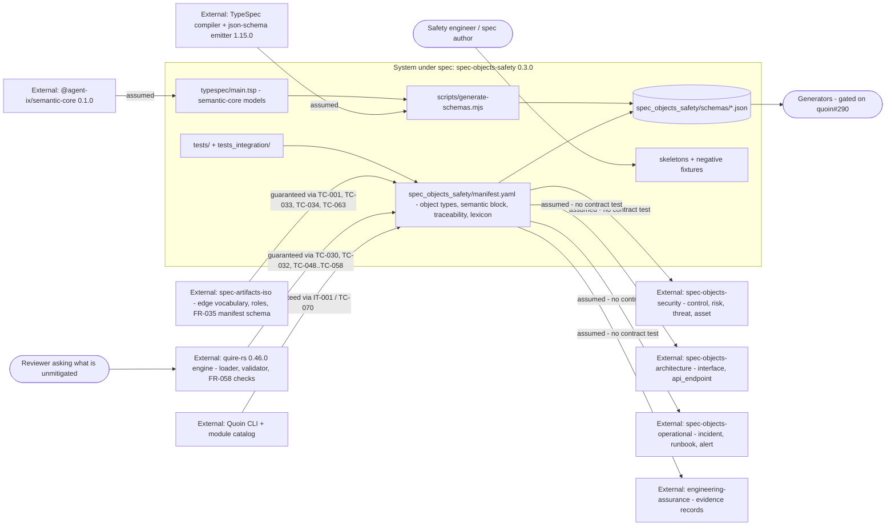

# Scope and boundary analysis of the issue #2 semantic-module-contract specification

## Summary

Boundary review of the `2-semantic-module-contract` bundle for
`agent-ix/spec-objects-safety#2`: what this module owns, what it consumes from
outside, whether each external dependency is assumed or guaranteed, and which
component owns each requirement. The base review (`base.md`) covered checklist
conformance, coverage bookkeeping and requirement quality and is not restated
here.

The internal allocation is clean. Every requirement has one obvious owning
component, no requirement straddles two, and `spec.md`'s Out of Scope section is
an unusually complete boundary statement — fourteen exclusions, each naming the
issue that owns it. FR-006 is a real boundary requirement rather than a
disclaimer: it states the non-duplication rule, the reference shape, and the
condition under which `semantic.imports` gets filled.

What the boundary analysis finds is on the other side of the line. The module's
headline capability — "which hazards have nothing addressing them" (StR-001
Rationale) — depends on an incoming `mitigates` edge into `hazard` and
`failure_mode`. No artifact type anywhere in the ecosystem can author that edge
without tripping a different check: `spec-objects-security`'s `control` declares
`mitigates: [threat, risk, vulnerability]`, and the `spec-artifacts-iso` `FR` and
`NFR` archetypes carry no `mitigates` in `allowed_links` at all. The obligation
to close that is allocated to `agent-ix/spec-objects-security#5`, which is
**closed**, and NFR-001-AC-4 then freezes the model that depends on it. That is
FND-001 and FND-002, both high.

Seven mediums follow, all on the same seam: an unconstrained `to: []` that lets
anything discharge the mitigation requirement, a neighbour-type list hand-copied
into the test that is meant to prevent hand-copying, an `engineering-assurance`
dependency on a type and a vocabulary that repository does not declare, two
cross-module reference planes of which only one is checked, no integration
artifact for any of the four sibling boundaries, a role mechanism rejected
without being evaluated against the boundary need it exists for, and a
`traceability` fact redeclared from a neighbour. Three lows close it out.

**Verdict: 🚧 CONDITIONAL** — the module is internally well-bounded, but its
principal external contract has no owner and is frozen in place. FND-001 and
FND-002 need a disposition (an issue against `spec-artifacts-iso` or
`spec-objects-security`, or an explicit Out of Scope entry naming it) before
planning. No file other than this review was edited.

## System Context

## In-Scope Responsibilities

- Declare exactly two object types, `hazard` and `failure_mode`, with their body
  contracts, `allowed_links`, and the domain lexicon (FR-001).
- Emit one JSON Schema 2020-12 document per declared model from a TypeSpec
  source importing `@agent-ix/semantic-core` 0.1.0, and keep the shipped bytes
  equal to the compiled ones (FR-002).
- Carry the quoin FR-070 `semantic` block and bind every exported type's schema
  by path and digest at manifest version 0.3.0 (FR-003).
- Fix the safety vocabulary and keep `unknown`, `not_assessed` and
  `not_applicable` distinct from every scale value, with no `default` on any
  scored axis (FR-004).
- Ship each skeleton as a document the engine validates and extracts, with a
  negative fixture per named refusal (FR-005).
- Reference — never redeclare — the control, risk, architecture, operational and
  evidence types other modules own (FR-006).
- Keep every 0.2.0 locator and the `traceability` model unchanged, adding only
  `required: false` locators (NFR-001).

Explicitly **not** guaranteed by this module, and correctly so: hazard
identification or scoring (FR-001-CON-1), any safety claim derived from schema
validity (FR-004-CON-2), generated language packages, and any edit to a corpus
repository or a sibling module (FR-005-CON-1).

## External Dependencies

| Dependency | Type | Assumed or Guaranteed | Contract |
|---|---|---|---|
| `@agent-ix/semantic-core` 0.1.0 | Declaration grammar (npm.ix) | Assumed | Exact pin in `package.json`; TC-014/TC-044 check that every `$ref` points at it, not that it behaves |
| `@typespec/compiler` + `@typespec/json-schema` 1.15.0 | Build toolchain | Assumed | Exact pins, TC-023; determinism checked locally by TC-021 |
| `spec-artifacts-iso` edge vocabulary (FR-004) | Vocabulary | Guaranteed | TC-007, TC-063 read the installed `manifest.yaml` and fail on an unknown verb |
| `spec-artifacts-iso` FR-035 module-manifest schema | Schema | Guaranteed, on a pinned revision | TC-001, TC-033, TC-034 against CR-012 `6686f11`; `spec-artifacts-iso#36` retires the pin |
| `quire-rs` 0.46.0 loader/validator/extractor | Engine | Guaranteed | TC-030, TC-032, TC-048..TC-058; FR-005-CON-3 makes an absent engine fail rather than skip |
| Quoin CLI + `~/.ix/filament/modules` | Install boundary | Guaranteed, currently 🚧 | IT-001 / TC-070, blocked on a broken local CLI build |
| `spec-objects-security` (`control`, `risk`, `threat`, `asset`, `vulnerability`) | Sibling module | **Assumed** | None. FR-006-AC-1 is checked against a list copied into `tests/test_cross_module_references.py`, not against the neighbour |
| `spec-objects-architecture` (`interface`, `api_endpoint`, `external_contract`) | Sibling module | **Assumed** | None — same copied list |
| `spec-objects-operational` (`incident`, `runbook`, `alert`) | Sibling module | **Assumed** | None — same copied list |
| `engineering-assurance` (evidence records, evidence-kind vocabulary) | Sibling module | **Assumed** | None. Neither the record type nor the vocabulary is declared by that repository (FND-005) |
| `spec-objects-security` hazard-coverage consumer of `traceability` | Cross-repo reader | **Assumed** | None. The named owner `#5` is closed (FND-002) |

Four of the five neighbour boundaries FR-006 exists to manage are `assumed`, and
the bundle presents them as settled. That asymmetry is the substance of this
review.

## Responsibility Allocation

| Requirement | Owning Component | Class |
|---|---|---|
| StR-001 | Module manifest (object-type declarations) | core |
| US-001 | Module manifest + TypeSpec source | core |
| FR-001 | Module manifest (`object_types`, `allowed_links`, `lexicon`) | core |
| FR-002 | Schema build (`typespec/`, `scripts/generate-schemas.mjs`, `make schemas`) | infrastructure |
| FR-003 | Module manifest (`semantic` block, `data_schema` references) | core |
| FR-004 | TypeSpec source (`typespec/main.tsp` models and enums) | core |
| FR-005 | Skeletons and negative fixtures (`spec_objects_safety/skeletons/`, `tests/fixtures/`) | core |
| FR-006 | Module manifest boundary declarations (`semantic.imports`, `traceability`, `EvidenceRef`) | cross-cutting |
| NFR-001 | Module manifest (locator set, `traceability`, lint allow-lists) | cross-cutting |
| IT-001 | Quoin install harness (`tests_integration/`) | infrastructure |

No requirement is unallocated, none is split across two components, and no cell
is TBD. The allocation defect is the inverse: two obligations this module's
requirements depend on (FND-001, FND-005) are allocated to components outside the
system boundary that do not implement them and carry no open ticket.

## Findings

| ID | Severity | Summary | Refs | Escape Cause |
|---|---|---|---|---|
| FND-001 | high | The incoming `mitigates` edge that both required relations depend on is authorable nowhere in the ecosystem. `spec-objects-security`'s `control` declares `mitigates: [threat, risk, vulnerability]` — neither `hazard` nor `failure_mode` — so a `control -> hazard` edge is reported `disallowed-edge-target` by the corpus check that resolves the source's target list. The `spec-artifacts-iso` `FR` and `NFR` archetypes carry no `mitigates` in `allowed_links` at all, so the requirement-end authoring FR-006 and NFR-001 both describe ("an FR says what it mitigates") is flagged `DisallowedEdgeType` at Tier-1. Both findings are advisory warnings rather than errors, so the edge can be written — but only against a diagnostic. The consequence is that `unmitigated-hazard` and `unmitigated-failure-mode` fire on every hazard and failure mode forever: the module's single reason to exist (StR-001 Rationale, "which hazards have nothing addressing them") produces only false positives, and no requirement in the bundle owns closing it. | manifest `traceability`; spec-objects-security manifest.yaml:326; spec-artifacts-iso manifest.yaml:113-124, 229-238; quire-rs src/validate_document.rs:470-501, src/corpus/validate.rs:414-452; FR-006 Behavior; StR-001-VC-2 | missing-requirement |
| FND-002 | high | The cross-repo consumer used to justify freezing the `traceability` model does not exist as an open obligation. `spec.md`, FR-003 Behavior, FR-006 Behavior, NFR-001 Rationale and the manifest all say the model is frozen because "`agent-ix/spec-objects-security`'s hazard-coverage work reads it across repositories". NFR-001 Downstream names `spec-objects-security#13`, whose stated objective is "Complete semantic data schemas for security object types" — a schema migration that says nothing about reading this module's traceability model. The work that did own bidirectional hazard coverage, `spec-objects-security#5`, is **closed**. So NFR-001-AC-4 and FR-003-AC-5 freeze the model fact-for-fact for a reader with no owner, and in doing so freeze FND-001 and FND-003 in place: narrowing `to:` or changing the direction later is non-additive by this module's own rule. | NFR-001 Rationale and Dependencies; FR-003 Behavior and AC-5; FR-006 Behavior; `gh issue view 5/13 --repo agent-ix/spec-objects-security` | wrong-requirement |
| FND-003 | medium | Both required relations declare `to: []`, so anything at all discharges the mitigation obligation — another hazard, an index, a log entry — provided it carries an outgoing `mitigates`. The module therefore cannot state the fact its own prose states, that the mitigation comes from a requirement. `quire-rs`'s own documentation of this feature uses this module as its worked example in the constrained form (`from: hazard` pointing `to: [FR]`). Combined with FND-002 the loose form is now frozen. | manifest `traceability.required_relations`; FR-003-AC-5; NFR-001-AC-4; quire-rs src/corpus/required_relations.rs:85-87 | wrong-requirement |
| FND-004 | medium | FR-006-AC-1's boundary — "no object type named by `spec-objects-security`, `spec-objects-architecture` or `spec-objects-operational`" — is verified against a list hand-copied into the test, and the copy is already stale. `NEIGHBOUR_TYPES` names 10 of the 23 types `spec-objects-security` declares (`auth_flow`, `permission`, `scope`, `role`, `secret`, `encryption_key`, `session_config`, `csrf_token`, `cors_policy`, `password_policy`, `mfa_method`, `jwt_claim`, `audit_event` are absent), 5 of 10 architecture types (`queue`, `action`, `ui_component`, `binary_format`, `rate_limit` absent), 6 of 8 operational types (`configuration`, `migration` absent), and `engineering-assurance` not at all. The requirement whose whole purpose is "do not keep a second copy of a neighbour's declarations" is enforced by a second copy of the neighbours' declarations. Nothing in FR-006 or `tests.md` says the list is derived from the installed neighbours or how it is kept current — contrast TC-063, which reads the iso manifest from the installed package and is the pattern this check should follow. | FR-006-AC-1; tests/test_cross_module_references.py:29-56; sibling manifests | correct-requirement-no-evidence |
| FND-005 | medium | The `engineering-assurance` boundary points at a type and a vocabulary that repository does not declare. FR-006 Inputs names it as the owner of evidence records, and FR-006 Behavior grounds `EvidenceRef.kind` staying an open string in "the closed evidence-kind vocabulary belongs to `agent-ix/engineering-assurance`". That module at 0.2.0 declares five doc-backed artifact types (`AssuranceProfile`, `MeasurementPlan`, `ArchitectureDescription`, `ComponentAssuranceContract`, `AssuranceArgument`), no object types, no `semantic` block, and no evidence-kind enum anywhere — evidence appears only as a required `Evidence Policy` section body. So `EvidenceRef.target` is a `SemanticId` to a record type nobody declares, and the reason `kind` is open cites a vocabulary that does not exist. `spec.md` compounds it: "none of the **four** neighbours above has published a semantic contract yet" is followed by **three** migration issues, and FR-006-AC-3/TC-062 assert exactly those three. The assurance dependency has no ticket, no contract and no owner. | FR-006 Inputs and Behavior; FR-006-AC-3; spec.md Out of Scope; engineering-assurance/engineering_assurance/manifest.yaml | missing-requirement |
| FND-006 | medium | Two cross-module reference planes exist and only one is checked. `allowed_links` on both object types admits `arises_from` and `references` targeting `hazard` and `failure_mode` only, so no document-level edge from a hazard to a `control`, an `interface` or an `incident` is authorable at all. Every cross-module reference lives instead in the semantic `relations` record as a `SemanticId` (FR-004, FR-006-AC-2), which the edge and traceability layers do not read — and cross-repository edge targets resolve as dangling regardless. `US-001-EX-3` ("the hazard names it rather than restating it") and the manifest's own comment ("a hazard references controls, risks, interfaces, incidents and evidence — every one BY `SemanticId` REFERENCE") describe a capability the bundle never states the resolution rule for: no requirement says which plane is authoritative, how a `SemanticId` resolves to a neighbour's object, or what happens when it does not. | FR-004 Behavior; FR-006-AC-2; US-001-EX-3; manifest `object_types[].allowed_links`; quire-rs src/corpus/validate.rs:381 | missing-requirement |
| FND-007 | medium | The bundle has one integration artifact, IT-001, and it covers the Quoin install boundary only. None of the four sibling-module boundaries FR-006 governs has an integration artifact, and nothing loads this module alongside a neighbour in one merged registry — which is where its boundary behaviour actually appears. Two merge effects are unverified: `acyclic_edges: [arises_from]` is declared by this module and identically by `spec-objects-security`, merged by union with de-duplication; and the merged `traceability` gains four required relations whose `check` keys must stay distinct across modules for FR-057 per-check tuning to work. FR-003 and NFR-001 test the block in isolation. | IT-001; FR-006; NFR-001 Rationale; quire-rs src/loader/mod.rs:1209-1211 | correct-requirement-no-evidence |
| FND-008 | medium | The role mechanism is rejected without being evaluated against the boundary need it exists for. `spec-artifacts-iso` declares a role registry whose stated purpose is exactly this problem — "cross-domain `allowed_links` target a **role** instead of a concrete cross-module type name" — which is the mechanism that would let a `control` declare `mitigates` against a role that `hazard` opts into, with neither module naming the other's type. FR-001 dismisses roles in one sentence ("the `safety-relevant` capability tag this module first reached for turned out to be unnecessary") on the grounds that `allowed_links` may target concrete types, which is true for the edges this module authors and irrelevant to the incoming edge of FND-001. The contradiction between that decision and FR-001-AC-1's "at least one role" is deferred to `#3`; the boundary question underneath it is not recorded anywhere. | FR-001 "No role is declared either"; FR-001-AC-1; spec-artifacts-iso manifest.yaml:964-978 | wrong-requirement |
| FND-009 | medium | `acyclic_edges: [arises_from]` is a neighbour's fact redeclared here, and it is unfalsifiable within this module. `arises_from` is authorable in this module only as `hazard -> failure_mode`, and `failure_mode` declares no outgoing `arises_from`, so no cycle over this module's own vocabulary can exist. The check can only ever fire on `spec-objects-security`'s `risk` edges — and that module already declares the identical `acyclic_edges: [arises_from]`. FR-006-CON-1 forbids minting a safety-only synonym for a verb or type another module declares, but neither it nor TC-064 covers a traceability *fact* another module already declares; the test checks verbs, schema keys and lexicon entries only. | manifest `traceability.acyclic_edges`; `object_types[].allowed_links`; spec-objects-security manifest.yaml `traceability`; FR-006-CON-1, TC-064 | wrong-requirement |
| FND-010 | low | The Quoin boundary is pinned to a commit rather than to a release. IT-001 Preconditions require "Quoin installed at a build carrying the semantic-module contract (`3e842ce` or later)", so the only external-boundary contract test in the bundle names an unreleased revision of another repository, with no issue recorded to retire the pin — contrast FR-003, which pins `spec-artifacts-iso` CR-012 and names `spec-artifacts-iso#36` as the retirement ticket. TC-070 is currently `🚧` because that same locally installed CLI is mid-build, so the boundary is at present pinned to a revision and verified by nothing. | IT-001 Preconditions; tests.md Coverage Gaps §1; FR-003 Inputs | correct-requirement-no-evidence |
| FND-011 | low | TC-063's comment justifies accepting inverse labels with "`mitigates` is one" — it is not. `mitigates` is a forward key in the iso `edge_types` map with no `inverse:` facet. The test's logic is correct (both forward keys and declared inverse labels are admitted); the stated reason for it is factually wrong about the one verb the module's traceability model depends on, which is exactly the verb a reader would check first. | tests/test_cross_module_references.py:121-149; spec-artifacts-iso manifest.yaml:919 | wrong-requirement |
| FND-012 | low | `nav.category.order: 55` claims a slot in an ordering namespace shared across every installed module, coordinated only by a comment ("following the family sequence — operational 53, security 54"). No requirement in the bundle owns the nav boundary, no test asserts the value, and nothing detects a collision when two modules claim one order. Minor, and consistent with the sibling modules, but it is an unallocated cross-module shared resource. | manifest `nav`; FR-001..FR-006 | missing-requirement |

## Boundary Verdict by Neighbour

| Neighbour | What this module claims | Holds? |
|---|---|---|
| `spec-artifacts-iso` | Every verb used exists in the shared vocabulary; the manifest conforms to FR-035 | ✅ verified against the installed package (TC-007, TC-063) and a pinned revision (TC-033, TC-034) |
| `quire-rs` | The manifest loads, both types register, skeletons validate and extract | ✅ verified, with two honest expected failures naming `#221`, `#391`, `#394` |
| Quoin | The module installs and lists with no `semantic.*` diagnostic | 🚧 tested but not currently passing; boundary pinned to a commit (FND-010) |
| `spec-objects-security` | Owns `control`/`risk`/`threat`; reads this module's `traceability`; is the `mitigates` source | ❌ the edge is unauthorable (FND-001), the reader has no owner (FND-002), the type list is a stale copy (FND-004) |
| `spec-objects-architecture` | Owns `interface`/`api_endpoint`/`external_contract`, referenced never redeclared | 🚧 true in fact, verified against a stale copied list (FND-004) |
| `spec-objects-operational` | Owns `incident`/`runbook`/`alert`, referenced never redeclared | 🚧 true in fact, verified against a stale copied list (FND-004) |
| `engineering-assurance` | Owns the evidence record type and the closed evidence-kind vocabulary | ❌ declares neither, and has no migration ticket (FND-005) |

## Notes

- The `semantic.imports: {}` decision is correct and well argued: pinning a
  semantic version a neighbour has not published would be a false claim, and
  FR-006 records both the obligation and the trigger to discharge it. FND-005 is
  not an argument against the empty map — it is that one of the four neighbours
  the map is waiting on has no ticket to wait for.
- The `hazard` / `failure_mode` / `threat` separation and the refusal to mint
  `causes` or `contributes_to` are the strongest boundary decisions in the
  bundle. Both are argued from the neighbouring vocabulary's own criteria rather
  than from convenience, and TC-064 keeps the second one true.
- FND-001 is not an argument for this module to declare a `controls` key. FR-004
  and FR-006 are right that the mitigation edge belongs at the requirement's
  end; the finding is that nobody has been asked to make that end able to
  author it.
- No spec artifact was edited by this review. Findings are reported for
  disposition by the branch author.
